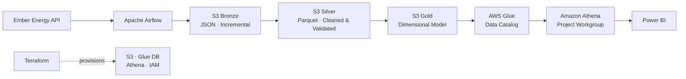
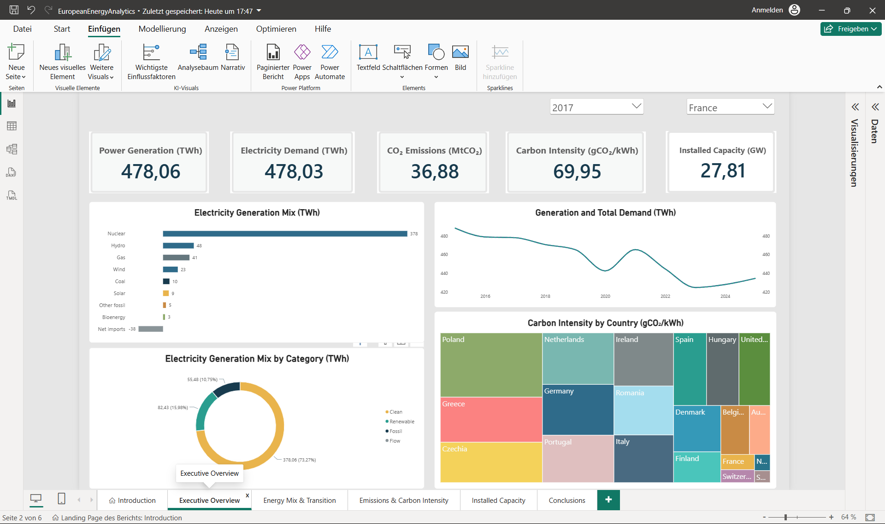

# European Energy Data Analytics

End-to-end ELT and analytics project for monthly European electricity data from the Ember Energy API.

## Architecture

## Tech Stack

Python · pandas · Apache Airflow · Docker · Terraform · GitHub Actions · Amazon S3 · AWS Glue · Amazon Athena · Parquet · SQL · Power BI

## Highlights

- Incremental monthly API ingestion with persistent S3 state
- Bronze / Silver / Gold medallion architecture
- Automated Silver and Gold data-quality checks
- Dimensional Gold model with conformed dimensions
- Monthly Airflow orchestration and Slack failure notifications
- Infrastructure as Code for S3, Glue database, Athena workgroup and IAM
- Versioned and encrypted S3 remote Terraform state with native locking
- CI checks for pytest and Terraform formatting/validation
- Serverless SQL analytics through a dedicated Athena workgroup
- Power BI reporting across 20 European countries

## Power BI Dashboard

[View the complete Power BI report (PDF)](powerbi/EuropeanEnergyAnalytics.pdf)

## Analytics

The project analyses electricity generation and demand, energy-mix transition, power-sector emissions and carbon intensity, and installed solar and wind capacity. The final Athena SQL queries are available in [`sql/analytics/`](sql/analytics/).

## Documentation

- [Architecture](docs/architecture/architecture.md)
- [Gold Data Model / ERD](docs/architecture/gold_erd.md)
- [Data Dictionary](docs/data_dictionary/data_dictionary.md)
- [Data Quality](docs/data_quality.md)
- [Architecture Decisions](docs/decisions/architecture_decisions.md)

Exploration, data understanding and EDA are documented in [`notebooks/`](notebooks/).
