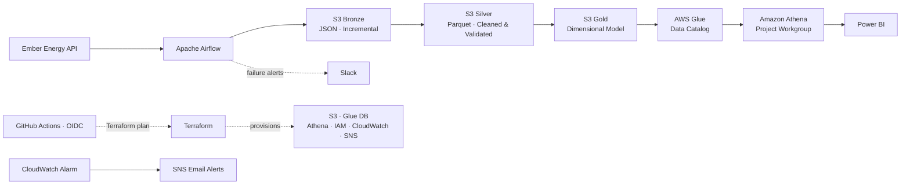
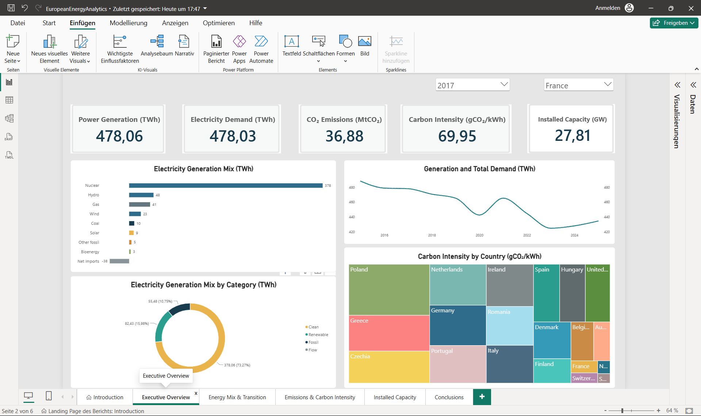

# European Energy Data Analytics

End-to-end ELT and analytics project for monthly European electricity data from the Ember Energy API.

## Architecture

```mermaid
flowchart LR
    API["Ember Energy API"] --> AF["Apache Airflow"]
    AF --> B["S3 Bronze<br/>JSON · Incremental"]
    B --> S["S3 Silver<br/>Parquet · Cleaned & Validated"]
    S --> G["S3 Gold<br/>Dimensional Model"]
    G --> GC["AWS Glue<br/>Data Catalog"]
    GC --> AT["Amazon Athena<br/>Project Workgroup"]
    AT --> BI["Power BI"]

    TF["Terraform"] -. provisions .-> AWS["S3 · Glue DB<br/>Athena · IAM · CloudWatch · SNS"]
    AF -. failure alerts .-> SL["Slack"]
    CW["CloudWatch Alarm"] --> SNS["SNS Email Alerts"]
    GA["GitHub Actions · OIDC"] -. Terraform plan .-> TF
```

## Tech Stack

Python · pandas · Apache Airflow · Docker · Terraform · GitHub Actions · Amazon S3 · AWS Glue · Amazon Athena · Parquet · SQL · Power BI

## Highlights

- Incremental monthly API ingestion with persistent S3 state
- Targeted historical backfills for controlled scope expansion without modifying incremental state
- Bronze / Silver / Gold medallion architecture
- Automated Silver and Gold data-quality checks
- Dimensional Gold model with conformed dimensions
- Coverage of 41 Ember-supported European markets across the core monthly datasets
- Dataset-specific source coverage for installed capacity
- Monthly Airflow orchestration and Slack failure notifications
- CloudWatch alarm for Athena failed queries, routed through SNS email alerts
- Infrastructure as Code for S3, Glue database, Athena workgroup and IAM
- Versioned and encrypted S3 remote Terraform state with native locking
- CI checks for pytest and Terraform formatting/validation; AWS-authenticated Terraform planning via GitHub OIDC with a guard against delete/replacement operations
- Serverless SQL analytics through the dedicated `european-energy-analytics` Athena workgroup
- Power BI reporting over the Gold model through Athena

## Infrastructure, CI/CD and Monitoring

Terraform manages the AWS infrastructure under [`infra/terraform/`](infra/terraform/), including S3, Glue, Athena, IAM, CloudWatch monitoring and SNS notifications. Remote Terraform state is stored in a separate encrypted, versioned S3 backend with native locking. Bootstrap IAM roles and policies support GitHub Actions authentication through OIDC and short-lived AWS credentials.

The Terraform CI workflow validates configuration, generates an AWS-backed saved plan and blocks plans containing delete or replacement actions. A passing plan check does **not** automatically apply infrastructure changes. Apply operations require an explicit, reviewed procedure; see [Architecture](docs/architecture/architecture.md) for the separation of responsibilities.

Airflow sends task failure notifications to Slack. CloudWatch monitors Athena failed-query metrics and routes alarm notifications through the existing SNS email topic.

## Data Coverage

The project scope contains 41 European markets available from Ember. Electricity generation, demand, power-sector emissions and carbon intensity use the full configured European scope. Installed capacity uses a smaller dataset-specific country scope because Ember provides monthly capacity data for fewer markets.

The regular pipeline remains incremental. Historical scope expansions are handled through an explicit backfill workflow that writes source responses to Bronze without changing the persistent incremental ingestion state. Silver and Gold snapshots are then rebuilt and validated from the expanded source history.

## Power BI Dashboard

[View the complete Power BI report (PDF)](powerbi/EuropeanEnergyAnalytics.pdf)

## Analytics

The project analyses electricity generation and demand, energy-mix transition, power-sector emissions and carbon intensity, and installed solar and wind capacity. The final Athena SQL queries are available in [`sql/analytics/`](sql/analytics/).

## Documentation

- [Architecture](docs/architecture/architecture.md)
- [Gold Data Model / ERD](docs/architecture/gold_erd.md)
- [Data Dictionary](docs/data_dictionary/data_dictionary.md)
- [Data Quality](docs/data_quality.md)
- [Architecture Decisions](docs/decisions/architecture_decisions.md)

Exploration, data understanding and EDA are documented in [`notebooks/`](notebooks/).
