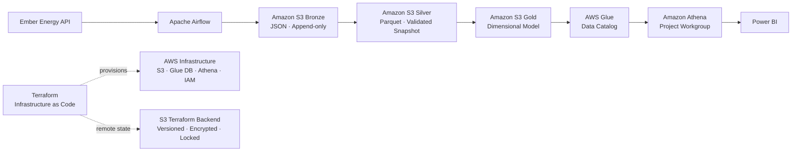
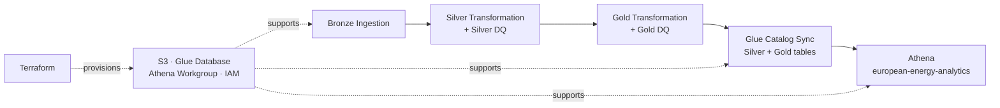

# Architecture

## Overview

Terraform manages the stable AWS infrastructure: the project S3 bucket configuration, Glue catalog database, dedicated Athena workgroup and runtime IAM policies/relationships. Terraform state is stored in a separate encrypted and versioned S3 backend with native state locking. Data-dependent Glue catalog tables remain pipeline-owned so Terraform and the runtime catalog synchronisation do not compete for the same resources.

## Source Scope

The configured analytical scope contains 41 Ember-supported European markets. Electricity generation, demand, power-sector emissions and carbon intensity use this common scope. Installed capacity uses a dataset-specific subset because Ember exposes monthly capacity data for fewer European markets.

Geographic scope is configuration-driven rather than embedded in transformation logic, allowing source coverage to evolve without changing the core pipeline.

## Bronze

The ingestion layer retrieves monthly electricity data from the Ember Energy API. Before downloading a dataset, the pipeline checks the latest available source month and compares it with a persistent ingestion state stored in S3. Only new source periods are requested.

Bronze stores the complete API response as JSON and remains append-only, preserving source-faithful ingestion history and traceability. A profile of the Bronze source data is available in [`docs/data_dictionary/bronze_data_profile.csv`](../data_dictionary/bronze_data_profile.csv).

Historical scope expansions use a separate targeted backfill entry point. Backfills load explicitly selected countries from the configured historical start date, respect dataset-specific country coverage and write the source response to Bronze without reading or modifying the regular incremental ingestion state. Downstream Silver and Gold snapshots are then rebuilt and validated from the expanded Bronze history.

## Silver

New Bronze increments are cleaned and typed with pandas and merged with the current Silver snapshot using dataset-specific business keys. The complete merged state is validated before the stable Silver Parquet object is replaced.

The transformation preserves valid source semantics: missing observations are not imputed, statistical outliers are not automatically removed, and negative net-import values are retained. Additional Silver rules are documented in [`silver_data_quality_guidelines.md`](../decisions/silver_data_quality_guidelines.md).

## Gold

Validated Silver datasets are transformed into a Fact Constellation / Galaxy model with four dimensions and five fact tables. Gold uses stable Parquet snapshot keys. Before persistence, the complete model is checked for key uniqueness, fact grain, required measures and referential integrity.

## Catalog and Analytics

The controlled Silver and Gold schemas are registered explicitly by the pipeline in the AWS Glue Data Catalog. The Glue database itself is infrastructure-managed by Terraform, while the 14 data-dependent catalog tables are pipeline-owned. This avoids configuration drift between Terraform and schema synchronisation.

Amazon Athena queries Parquet directly in S3 through the dedicated `european-energy-analytics` workgroup, providing a serverless SQL layer without a permanently running analytical database. Query results are written to the project's `athena-results/` S3 prefix with SSE-S3 encryption. The runtime Athena policy restricts query operations to this workgroup while retaining the catalog metadata permissions required by the pipeline.

The final analytical SQL queries are version-controlled under [`sql/analytics/`](../../sql/analytics/). Power BI consumes the Gold model through Athena in Import mode.

## Orchestration

Apache Airflow orchestrates the regular runtime data flow; Terraform provisions the stable AWS resources used by that flow. The Silver and Gold data-quality checks execute inside their respective transformation tasks rather than as separate Airflow tasks:

The DAG runs monthly on the 10th at 14:00 Europe/Berlin with `catchup=False`. Slack provides failure notifications. Historical backfills are explicit maintenance operations rather than part of the monthly DAG. Legacy Glue crawlers are no longer part of the target architecture because catalog table creation and updates are handled explicitly by the pipeline.

## Infrastructure as Code

Terraform configuration lives under [`infra/terraform/`](../../infra/terraform/). Existing AWS resources were imported where appropriate, while the dedicated Athena workgroup was provisioned directly through Terraform. The remote backend is separate from the analytics data bucket and uses S3 versioning, SSE-S3 encryption, public-access blocking and S3-native state locking.

CI performs Terraform formatting and validation checks without AWS credentials or automated `terraform apply`. Infrastructure changes therefore remain an explicit reviewed operation rather than an automatic deployment from CI.

## Security

The pipeline uses a dedicated least-privilege AWS identity. Destructive S3 permissions are deliberately excluded from the pipeline identity, and Athena query actions are scoped to the project workgroup. Local development uses AWS CLI profiles; access keys and administrative identities are intentionally outside Terraform management. A production deployment should prefer IAM roles and temporary credentials.
