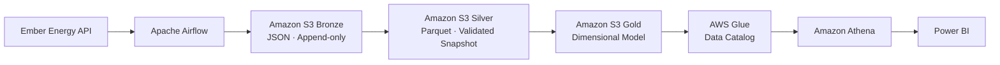
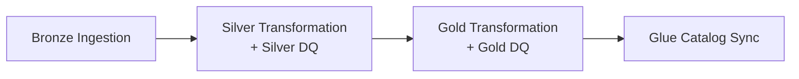

# Architecture

## Overview

## Bronze

The ingestion layer retrieves monthly electricity data from the Ember Energy API. Before downloading a dataset, the pipeline checks the latest available source month and compares it with a persistent ingestion state stored in S3. Only new source periods are requested.

Bronze stores the complete API response as JSON and remains append-only, preserving source-faithful ingestion history and traceability. A profile of the Bronze source data is available in [`docs/data_dictionary/bronze_data_profile.csv`](../data_dictionary/bronze_data_profile.csv).

## Silver

New Bronze increments are cleaned and typed with pandas and merged with the current Silver snapshot using dataset-specific business keys. The complete merged state is validated before the stable Silver Parquet object is replaced.

The transformation preserves valid source semantics: missing observations are not imputed, statistical outliers are not automatically removed, and negative net-import values are retained. Additional Silver rules are documented in [`silver_data_quality_guidelines.md`](../decisions/silver_data_quality_guidelines.md).

## Gold

Validated Silver datasets are transformed into a Fact Constellation / Galaxy model with four dimensions and five fact tables. Gold uses stable Parquet snapshot keys. Before persistence, the complete model is checked for key uniqueness, fact grain, required measures and referential integrity.

## Catalog and Analytics

The controlled Silver and Gold schemas are registered explicitly in the AWS Glue Data Catalog. Amazon Athena uses this metadata to query Parquet directly in S3, providing a serverless SQL layer without a permanently running analytical database.

The final analytical SQL queries are version-controlled under [`sql/analytics/`](../../sql/analytics/). Power BI consumes the Gold model through Athena in Import mode.

## Orchestration

Apache Airflow executes four pipeline tasks. The Silver and Gold data-quality checks run inside their respective transformation tasks rather than as separate Airflow tasks:

The DAG runs monthly on the 10th at 14:00 Europe/Berlin with `catchup=False`. Slack provides failure notifications.

## Security

The pipeline uses a dedicated least-privilege AWS identity. Destructive S3 permissions are deliberately excluded from the pipeline identity. Local development uses an AWS CLI profile; a production deployment should prefer IAM roles and temporary credentials.
