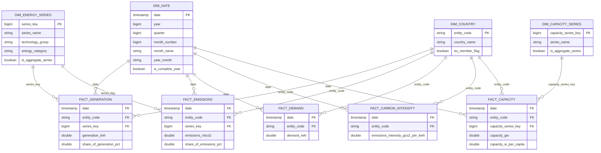

# Gold-Datenmodell – ERD

Dieses Diagramm dokumentiert das analytische Gold-Modell des Projekts als **Fact Constellation / Galaxy Schema**.

Mehrere Faktentabellen bilden unterschiedliche fachliche Prozesse ab und teilen sich gemeinsame Dimensionen. Die Beziehungen sind im Gold-Modell logisch definiert und werden später auch im semantischen Modell von Power BI verwendet.

## Grain der Faktentabellen

| Faktentabelle | Grain |
|---|---|
| `fact_generation` | Land × Monat × Energiereihe |
| `fact_emissions` | Land × Monat × Energiereihe |
| `fact_demand` | Land × Monat |
| `fact_carbon_intensity` | Land × Monat |
| `fact_capacity` | Land × Monat × Kapazitätsreihe |

## Schlüsselstrategie

- `dim_date` verwendet das Monatsdatum als stabilen natürlichen Schlüssel.
- `dim_country` verwendet `entity_code` als stabilen Business Key.
- `dim_energy_series` verwendet `series_key` als Surrogate Key für Generation und Emissionen.
- `dim_capacity_series` verwendet einen separaten `capacity_series_key`, weil die Semantik einzelner Reihen – insbesondere `Wind` – zwischen Capacity und den übrigen Datensätzen unterschiedlich sein kann.

## Architekturhinweis

Die physischen Gold-Daten liegen als Parquet-Dateien in Amazon S3. Der AWS Glue Data Catalog verwaltet die Tabellenschemata und Amazon Athena verwendet diese Metadaten für serverlose SQL-Abfragen direkt auf S3. Die hier dargestellten PK-/FK-Beziehungen sind logische Modellbeziehungen und keine physisch erzwungenen Constraints in Athena.
